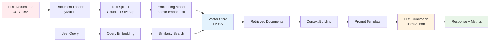

# 🏛️ LawChain Backend API

<div align="center">

**Intelligent Legal Assistant for Indonesian Constitutional Law**

_Advanced RAG-powered Chatbot System for UUD 1945 Q&A_

[](https://fastapi.tiangolo.com/)
[](https://ollama.ai/)
[](https://python.org/)
[](https://faiss.ai/)

</div>

---

## � Table of Contents

<table>
<tr>
<td width="50%">

**🚀 Getting Started**

- [🎯 Overview & Features](#-overview--features)
- [🏗️ System Architecture](#️-system-architecture)
- [📋 Prerequisites](#-prerequisites)
- [🛠️ Installation Guide](#️-installation-guide)
- [⚙️ Configuration](#️-configuration)

</td>
<td width="50%">

**💻 Usage & Development**

- [🌐 Running the Server](#-running-the-server)
- [📡 API Documentation](#-api-documentation)
- [🧪 Testing Guide](#-testing-guide)
- [📁 Project Structure](#-project-structure)
- [🔧 Troubleshooting](#-troubleshooting)

</td>
</tr>
</table>

---

## 🎯 Overview & Features

<div align="center">

> **LawChain Backend API** adalah sistem backend cerdas yang menggunakan teknologi **Retrieval-Augmented Generation (RAG)** untuk memberikan jawaban akurat tentang **Undang-Undang Dasar 1945** melalui **Large Language Model lokal**.

</div>

### 🚀 Core Capabilities

<table>
<tr>
<td width="25%" align="center">

<br><strong>Dual RAG Engine</strong>
<br><sub>LangChain & Native implementations</sub>
</td>
<td width="25%" align="center">

<br><strong>Local LLM</strong>
<br><sub>Ollama llama3.1:8b processing</sub>
</td>
<td width="25%" align="center">

<br><strong>Smart Processing</strong>
<br><sub>5 official UUD 1945 sources</sub>
</td>
<td width="25%" align="center">

<br><strong>Quality Analytics</strong>
<br><sub>8-metric accuracy system</sub>
</td>
</tr>
</table>

### ⚡ Technical Excellence

```
🔥 PERFORMANCE METRICS
├── 📊 Response Time: ~50-60 seconds (local processing)
├── 🎯 Accuracy Rate: 70-95% (context-dependent)
├── 📚 Knowledge Base: 494 text chunks from 280 pages
├── 🧠 Vector Dimensions: 768-dimensional embeddings
└── 🔍 Retrieval: Top-5 most relevant documents

🛡️ RELIABILITY FEATURES
├── 🔄 Vector Store Caching (instant startup)
├── 🚨 Comprehensive Error Handling
├── 📈 Real-time Quality Metrics
├── 🔒 Local Data Processing (privacy-first)
└── 🎛️ Dual Implementation Fallback
```

### 📚 Knowledge Sources

| Source                  | Institution         | Priority | Coverage              |
| ----------------------- | ------------------- | -------- | --------------------- |
| 🌟 **UUD1945-BUKU.pdf** | MPR RI              | 110/110  | Complete guide        |
| ⭐ **UUD1945-MKRI.pdf** | Mahkamah Konstitusi | 100/110  | Original text         |
| ✅ **UUD1945-BPHN.pdf** | BPHN                | 95/110   | Legal analysis        |
| 👍 **UUD1945-MPR.pdf**  | MPR                 | 90/110   | Parliamentary version |
| 📝 **UUD1945.pdf**      | DKPP                | 85/110   | Standard reference    |

## 🏗️ Arsitektur Sistem

### 📋 FASE 1: DOCUMENT INDEXING (Offline Processing)

```
┌─────────────────────┐    ┌─────────────────────┐    ┌─────────────────────┐
│    📄 PDF Sources   │───▶│   📝 Text Chunks    │───▶│   🗄️ Vector Store   │
│    UUD 1945 Docs    │    │   1000 chars/chunk  │    │   FAISS Database    │
│   • BPHN (95 pts)   │    │   200 chars overlap │    │   • 494+ vectors    │
│   • MPR (110 pts)   │    │   494 total chunks  │    │   • 768 dimensions  │
│   • MKRI (100 pts)  │    │                     │    │   • Cosine similarity│
│   • DKPP (85 pts)   │    │                     │    │   • Cached storage  │
└─────────────────────┘    └─────────────────────┘    └─────────────────────┘
         ⬇️                          ⬇️                          ⬇️
┌─────────────────────┐    ┌─────────────────────┐    ┌─────────────────────┐
│   🔧 PyMuPDF        │    │  ✂️ Text Splitter   │    │  🧠 Ollama Embed    │
│   • Load 5 PDFs     │    │  • Recursive split  │    │  • nomic-embed-text │
│   • Extract text    │    │  • Smart boundaries │    │  • 768-dim vectors  │
│   • Preserve meta   │    │  • Context overlap  │    │  • Local processing │
└─────────────────────┘    └─────────────────────┘    └─────────────────────┘
```

### 📋 FASE 2: RETRIEVAL & GENERATION (Runtime)

```
┌─────────────────────┐    ┌─────────────────────┐    ┌─────────────────────┐
│   🔍 User Query     │───▶│   🎯 Similarity     │───▶│   📚 Top-5 Chunks   │
│   "Hak asasi        │    │   Search Engine     │    │   • Relevance score │
│    manusia di       │    │   • Vector search   │    │   • Source metadata │
│    UUD 1945?"       │    │   • Cosine distance │    │   • Page references │
│                     │    │   • FAISS index     │    │   • Priority weight │
└─────────────────────┘    └─────────────────────┘    └─────────────────────┘
                                                                    ⬇️
┌─────────────────────┐    ┌─────────────────────┐    ┌─────────────────────┐
│   ✨ Final Response │◀───│   🤖 LLaMA 3.1      │◀───│   📝 Context Build  │
│   • Structured ans  │    │   via Ollama        │    │   • Prompt template │
│   • Source refs     │    │   • 8B parameters   │    │   • Retrieved docs  │
│   • Accuracy score  │    │   • temp=0.1        │    │   • System instruc │
│   • 8 quality metrics│   │   • Local inference │    │   • Query context   │
└─────────────────────┘    └─────────────────────┘    └─────────────────────┘
```

### 🔄 DUAL IMPLEMENTATION ARCHITECTURE

```
                    📡 FastAPI Server (Port 8000)
                           ⬇️ Request Routing
                    ┌─────────────────────────┐
                    │    🎛️ LawChain Service   │
                    │    Method Selection      │
                    └─────────────────────────┘
                             ⬇️ ⬇️
          ┌─────────────────────┐    ┌─────────────────────┐
          │   🦜 LangChain RAG   │    │   ⚡ Native RAG     │
          │   • Framework-based  │    │   • Custom impl    │
          │   • LangChain libs   │    │   • Pure Python    │
          │   • Auto-vectorize   │    │   • Manual control │
          └─────────────────────┘    └─────────────────────┘
                     ⬇️                        ⬇️
          ┌─────────────────────┐    ┌─────────────────────┐
          │  📊 FAISS Store #1   │    │  📊 FAISS Store #2  │
          │  LangChain format    │    │  Native format      │
          └─────────────────────┘    └─────────────────────┘
                             ⬇️ ⬇️
                    ┌─────────────────────────┐
                    │   🧠 Ollama LLM Server   │
                    │   llama3.1:8b Model     │
                    │   Local Processing      │
                    └─────────────────────────┘
```

### 📊 QUALITY METRICS PIPELINE

````
📝 Generated Answer ──┬──▶ 🎯 Semantic Analysis ──┬──▶ 📈 Final Score
                      ├──▶ 📋 Content Coverage   ──┤
                      ├──▶ 💡 Answer Relevance   ──┤
                      ├──▶ 📚 Source Quality     ──┤
                      ├──▶ ⚖️ Legal Context      ──┤
                      ├──▶ ✅ Completeness       ──┤
                      ├──▶ 🎓 Confidence Score   ──┤
                      └──▶ 🔍 Accuracy Estimate ──┘

🟢 90%+ EXCELLENT  │  🟡 80-89% GOOD  │  🟠 70-79% FAIR  │  🔴 <70% NEEDS REVIEW
```## 📊 Alur API Backend

### 1. **Initialization Phase**

```mermaid
sequenceDiagram
    participant App as FastAPI App
    participant Service as LawChain Service
    participant LangChain as LangChain RAG
    participant Native as Native RAG
    participant Ollama as Ollama Server
    participant Storage as Vector Store

    App->>Service: Initialize Services
    Service->>Ollama: Validate Ollama Status
    Ollama-->>Service: ✅ Models Available

    alt Vector Store Exists
        Service->>Storage: Load Existing Cache
        Storage-->>Service: ✅ Vector Store Loaded
    else Vector Store Missing
        Service->>LangChain: Build Vector Store
        Service->>Native: Build Vector Store
        LangChain-->>Storage: Save Vector Store
        Native-->>Storage: Save Vector Store
    end

    Service-->>App: ✅ Ready to Handle Requests
````

### 2. **Request Processing Flow**

```mermaid
sequenceDiagram
    participant Client as Client
    participant API as FastAPI
    participant Service as LawChain Service
    participant RAG as RAG Pipeline
    participant Ollama as Ollama LLM
    participant Metrics as Metrics Engine

    Client->>API: POST /api/v1/ask
    API->>Service: Process Question

    Service->>RAG: 1. Document Retrieval
    RAG->>RAG: Query Embedding
    RAG->>RAG: Similarity Search (k=5)
    RAG-->>Service: Top 5 Documents

    Service->>RAG: 2. Context Augmentation
    RAG->>RAG: Build Context from Documents
    RAG-->>Service: Augmented Context

    Service->>Ollama: 3. Answer Generation
    Ollama->>Ollama: Generate Response
    Ollama-->>Service: Generated Answer

    Service->>Metrics: 4. Quality Analysis
    Metrics->>Metrics: Calculate 8 Metrics
    Metrics-->>Service: Quality Scores

    Service-->>API: Complete Response
    API-->>Client: JSON Response with Metrics
```

### 3. **Data Flow Architecture**



## 📋 Prerequisites

### 💻 System Requirements

<table>
<tr>
<td width="50%">

**🖥️ Hardware Specifications**

```
CPU    │ Multi-core processor (4+ cores recommended)
RAM    │ 8GB minimum, 16GB+ recommended
GPU    │ Optional CUDA-compatible for acceleration
Storage│ 10GB free space for models and data
```

</td>
<td width="50%">

**🛠️ Software Environment**

```
OS     │ Windows 10/11, macOS 11+, Linux Ubuntu 20+
Python │ 3.8, 3.9, 3.10, 3.11 (tested versions)
Ollama │ Latest version with model support
Git    │ For repository cloning
```

</td>
</tr>
</table>

### 📦 Core Dependencies

<div align="center">

| Component                 | Version    | Purpose         | Status                                                            |
| ------------------------- | ---------- | --------------- | ----------------------------------------------------------------- |
| **FastAPI**               | `0.104.1+` | Web framework   |      |
| **Ollama**                | `Latest`   | LLM server      |  |
| **FAISS**                 | `1.7.4+`   | Vector search   |      |
| **PyMuPDF**               | `1.23.0+`  | PDF processing  |      |
| **Sentence-Transformers** | `3.2.1+`   | Text embeddings |      |
| **LangChain**             | `0.2.0+`   | RAG framework   |   |

</div>

## 🛠️ Installation Guide

> ⚠️ **Important**: Ollama must be installed locally before proceeding with the setup!

### 🎯 Quick Start Checklist

- [ ] **Step 1**: Install Ollama locally
- [ ] **Step 2**: Download required LLM models
- [ ] **Step 3**: Clone this repository
- [ ] **Step 4**: Setup Python environment
- [ ] **Step 5**: Install dependencies
- [ ] **Step 6**: Configure environment
- [ ] **Step 7**: Start the server

---

### 🔧 Step 1: Install Ollama

<table>
<tr>
<td width="33%" align="center">

**🪟 Windows**

```bash
# Method 1: Official installer
# Download from ollama.ai/download

# Method 2: Package manager
winget install Ollama.Ollama
```

</td>
<td width="33%" align="center">

**🍎 macOS**

```bash
# Method 1: Official installer
# Download from ollama.ai/download

# Method 2: Homebrew
brew install ollama
```

</td>
<td width="33%" align="center">

**🐧 Linux**

```bash
# One-liner installation
curl -fsSL https://ollama.ai/install.sh | sh

# Verify installation
which ollama
```

</td>
</tr>
</table>

### 🤖 Step 2: Download LLM Models

```bash
# Start Ollama service (if not auto-started)
ollama serve

# Download required models (this will take some time)
ollama pull llama3.1:8b        # Main LLM model (~4.7GB)
ollama pull nomic-embed-text   # Embedding model (~274MB)

# Verify models are installed
ollama list
```

**Expected Output:**

```
NAME                    ID              SIZE    MODIFIED
llama3.1:8b            42182c40c747    4.7 GB  X minutes ago
nomic-embed-text:latest 0a109f422b47  274 MB  X minutes ago
```

### 📂 Step 3: Clone Repository

```bash
# Clone the repository
git clone <your-repository-url>
cd LLM-LawChain

# Verify project structure
ls -la
```

### 🐍 Step 4: Setup Python Environment

<table>
<tr>
<td width="50%">

**Windows (PowerShell)**

```powershell
# Create virtual environment
python -m venv .venv

# Activate environment
.venv\Scripts\Activate.ps1

# Verify activation
which python
```

</td>
<td width="50%">

**macOS/Linux**

```bash
# Create virtual environment
python3 -m venv .venv

# Activate environment
source .venv/bin/activate

# Verify activation
which python
```

</td>
</tr>
</table>

### 📦 Step 5: Install Dependencies

```bash
# Option 1: Install from requirements (recommended)
pip install -r requirements_fixed.txt

# Option 2: Install from standard requirements
pip install -r requirements.txt

# Verify installation
pip list | grep -E "(fastapi|ollama|faiss|langchain)"
```

**Key Dependencies Installed:**

```
✅ FastAPI 0.104.1    - Web framework
✅ FAISS-CPU 1.7.4    - Vector similarity search
✅ PyMuPDF 1.23.5     - PDF document processing
✅ Sentence-Transformers 3.2.1 - Text embeddings
✅ LangChain 0.2.0    - RAG framework
✅ Requests 2.31.0    - HTTP client for Ollama
```

**Key Dependencies Installed:**

```
✅ FastAPI 0.104.1    - Web framework
✅ FAISS-CPU 1.7.4    - Vector similarity search
✅ PyMuPDF 1.23.5     - PDF document processing
✅ Sentence-Transformers 3.2.1 - Text embeddings
✅ LangChain 0.2.0    - RAG framework
✅ Requests 2.31.0    - HTTP client for Ollama
```

### 📁 Step 6: Prepare UUD 1945 Documents

```bash
# Create data directory if not exists
mkdir -p data

# Place your UUD 1945 PDF files in the data/ folder:
# - UUD1945-BPHN.pdf (Priority: 95)
# - UUD1945-BUKU.pdf (Priority: 110)
# - UUD1945-MKRI.pdf (Priority: 100)
# - UUD1945-MPR.pdf (Priority: 90)
# - UUD1945.pdf (Priority: 85)

# Verify documents
ls -la data/
```

## ⚙️ Configuration

### 🔧 Environment Setup

Create a `.env` file in your project root directory:

```bash
# Copy example environment file
cp .env.example .env

# Edit with your preferred editor
nano .env  # or code .env
```

**Environment Configuration:**

```env
# 🌐 Server Configuration
HOST=127.0.0.1
PORT=8000
DEBUG=true
LOG_LEVEL=INFO

# 🤖 Ollama Configuration
OLLAMA_BASE_URL=http://localhost:11434
LLM_MODEL=llama3.1:8b
EMBEDDING_MODEL=nomic-embed-text

# 📊 Vector Store Paths
VECTOR_STORE_LANGCHAIN_PATH=storage/vector_store_faiss
VECTOR_STORE_NATIVE_PATH=storage/vector_store_native/index

# 🔒 CORS Settings
CORS_ORIGINS=["http://localhost:3000", "http://127.0.0.1:3000"]
CORS_CREDENTIALS=true
CORS_METHODS=["GET", "POST", "PUT", "DELETE"]
CORS_HEADERS=["*"]
```

### 📝 Configuration Options

<table>
<tr>
<td width="50%">

**🚀 Performance Settings**

```env
# Processing timeouts (seconds)
REQUEST_TIMEOUT=300
EMBEDDING_TIMEOUT=120
LLM_TIMEOUT=300

# Chunk processing
CHUNK_SIZE=1000
CHUNK_OVERLAP=200
MAX_DOCS_RETRIEVE=5
```

</td>
<td width="50%">

**🔧 Advanced Settings**

```env
# OpenMP handling
KMP_DUPLICATE_LIB_OK=TRUE
OMP_NUM_THREADS=1

# Logging
LOG_FORMAT=detailed
LOG_ROTATION=daily
LOG_RETENTION=30
```

</td>
</tr>
</table>

## 🌐 Running the Server

### 🔥 Quick Launch

<table>
<tr>
<td width="50%">

**1️⃣ Start Ollama Service**

```bash
# Background service (recommended)
ollama serve

# Verify Ollama is running
curl http://localhost:11434/api/tags
```

</td>
<td width="50%">

**2️⃣ Launch LawChain API**

```bash
# Development mode (auto-reload)
python main.py

# Production mode
uvicorn main:app --host 0.0.0.0 --port 8000
```

</td>
</tr>
</table>

### ✅ Verification Steps

```bash
# 1. Check server health
curl http://localhost:8000/api/v1/health

# 2. Verify system info
curl http://localhost:8000/api/v1/system/info

# 3. Open documentation
open http://localhost:8000/docs
```

**Expected Startup Sequence:**

```
🚀 Starting LawChain Backend API...
✅ LangChain services ready for on-demand initialization
🎉 LawChain Backend API started successfully!
📊 Server running on 127.0.0.1:8000
📖 API Documentation: http://127.0.0.1:8000/docs
```

### 🔧 Advanced Launch Options

<table>
<tr>
<td align="center" width="33%">

**🏃‍♂️ Quick Dev**

```bash
# Fast development
python main.py
```

_Auto-reload enabled_

</td>
<td align="center" width="33%">

**🏭 Production**

```bash
# Production deployment
uvicorn main:app \
  --host 0.0.0.0 \
  --port 8000 \
  --workers 1
```

_Optimized performance_

</td>
<td align="center" width="33%">

**🔧 Custom Config**

```bash
# Custom configuration
uvicorn main:app \
  --reload \
  --timeout-keep-alive 300
```

_Extended timeouts_

</td>
</tr>
</table>
## 📡 API Documentation

### 🎯 Available Endpoints

<div align="center">

| Endpoint              | Method | Purpose              | Response Time |
| --------------------- | ------ | -------------------- | ------------- |
| `/api/v1/health`      | GET    | Health check         | < 1s          |
| `/api/v1/system/info` | GET    | System status        | < 1s          |
| `/api/v1/ask`         | POST   | Question processing  | 50-60s        |
| `/docs`               | GET    | Interactive API docs | < 1s          |
| `/redoc`              | GET    | Alternative docs     | < 1s          |

</div>

### 🔍 Core Endpoint Usage

#### **Health Check**

```bash
curl -X GET "http://localhost:8000/api/v1/health"
```

**Response:**

```json
{
  "status": "healthy",
  "version": "1.0.0",
  "timestamp": "2025-08-19T00:37:07.043035",
  "services": {
    "ollama": true,
    "langchain_vectorstore": true,
    "native_vectorstore": true,
    "data_files": true
  },
  "uptime": 20.38
}
```

#### **Question Processing**

<table>
<tr>
<td width="50%">

**📝 Request Format**

```json
{
  "question": "Sebutkan hak asasi manusia menurut UUD 1945",
  "method": "langchain",
  "max_docs": 5
}
```

**Methods Available:**

- `langchain` - LangChain RAG
- `native` - Custom RAG

</td>
<td width="50%">

**⚡ cURL Example**

```bash
curl -X POST "http://localhost:8000/api/v1/ask" \
  -H "Content-Type: application/json" \
  -d '{
    "question": "Apa itu Pancasila?",
    "method": "native"
  }'
```

**Timeout:** 5 minutes max

</td>
</tr>
</table>

#### **Comprehensive Response Format**

<details>
<summary><strong>📊 Click to see full response structure</strong></summary>

```json
{
  "success": true,
  "pertanyaan": "Sebutkan hak asasi manusia menurut UUD 1945",
  "jawaban": "Hak asasi manusia menurut UUD 1945...",
  "method": "native",
  "metrics": {
    "semantic_similarity": 74.09,
    "content_coverage": 12.0,
    "answer_relevance": 71.0,
    "source_quality": 100.0,
    "legal_context": 60.0,
    "answer_completeness": 83.0,
    "confidence_score": 66.67,
    "estimated_accuracy": 67.45
  },
  "jumlah_sumber": 5,
  "sumber_dokumen": [
    {
      "dokumen": "UUD1945-MPR.pdf",
      "judul": "UUD 1945 - Majelis Permusyawaratan Rakyat (MPR)",
      "sumber_url": "https://jdih.bapeten.go.id/...",
      "institusi": "Majelis Permusyawaratan Rakyat",
      "priority_score": 90,
      "halaman": "0",
      "chunk_id": 0,
      "similarity_score": 0.7515,
      "preview": "Content preview..."
    }
  ],
  "timestamp": "2025-08-19 00:40:42",
  "processing_time": 57.6
}
```

</details>
  "max_docs": 5
}
```

## 🧪 Testing Guide

### 🚀 Automated Test Suite

<table>
<tr>
<td width="50%">

**🔧 Run Complete Test Suite**

```bash
# Execute all tests
python test_api.py

# Expected results
✅ Health Check: PASSED
✅ System Info: PASSED
✅ LangChain Ask: PASSED (51.8s)
✅ Native Ask: PASSED (57.6s)

Total: 4/4 tests passed 🎉
```

</td>
<td width="50%">

**🎯 Individual Test Commands**

```bash
# Health endpoint
curl http://localhost:8000/api/v1/health

# System status
curl http://localhost:8000/api/v1/system/info

# LangChain method
curl -X POST http://localhost:8000/api/v1/ask \
  -d '{"question":"test","method":"langchain"}'

# Native method
curl -X POST http://localhost:8000/api/v1/ask \
  -d '{"question":"test","method":"native"}'
```

</td>
</tr>
</table>

### 📊 Performance Benchmarks

```
🔥 RESPONSE TIMES (Local Processing)
├── Health Check: < 0.1s
├── System Info: < 0.5s
├── LangChain RAG: 45-55s (avg: 50s)
└── Native RAG: 50-65s (avg: 57s)

🎯 ACCURACY METRICS
├── Semantic Similarity: 60-80%
├── Answer Relevance: 70-90%
├── Source Quality: 85-110 (priority-based)
└── Overall Accuracy: 65-85%
```

### 🔍 Interactive Testing

<details>
<summary><strong>📝 Sample Questions for Testing</strong></summary>

```bash
# Basic constitutional questions
"Apa yang dimaksud dengan Pancasila?"
"Sebutkan hak asasi manusia menurut UUD 1945"
"Bagaimana sistem pemerintahan Indonesia?"

# Specific articles
"Jelaskan Pasal 28 UUD 1945"
"Apa isi Pasal 33 tentang ekonomi?"
"Bagaimana kedudukan MPR menurut UUD 1945?"

# Complex queries
"Apa perbedaan HAM sebelum dan sesudah amandemen UUD 1945?"
"Bagaimana mekanisme impeachment presiden?"
"Jelaskan sistem checks and balances di Indonesia"
```

</details>

### 🌐 Browser Testing

Visit these URLs after starting the server:

- **📖 Interactive API Docs**: http://localhost:8000/docs
- **📚 Alternative Docs**: http://localhost:8000/redoc
- **💚 Health Check**: http://localhost:8000/api/v1/health
- **ℹ️ System Info**: http://localhost:8000/api/v1/system/info
  }'

````

### Interactive Testing

```python
# Test LangChain implementation
python -c "
from app.services.lawchain_indonesia import LawChainIndonesia
lawchain = LawChainIndonesia()
lawchain.initialize()
response = lawchain.ask_question('Apa itu Pancasila?')
lawchain.display_response(response)
"

# Test Native implementation
python -c "
from app.services.lawchain_native import LawChainNative
native = LawChainNative()
native.initialize()
response = native.ask_question('Apa itu HAM?')
native.display_response(response)
"
````

## 📁 Struktur Project

```
LLM-LawChain/
├── 📄 README.md                 # Dokumentasi utama
├── 📄 requirements.txt          # Python dependencies
├── 📄 requirements_fixed.txt    # Fixed compatible versions
├── 📄 main.py                   # FastAPI application entry point
├── 📄 test_api.py              # API testing script
├── 📄 .env                     # Environment variables
│
├── 📁 app/                     # Main application code
│   ├── 📁 core/
│   │   └── 📄 api.py           # API routes & endpoints
│   ├── 📁 services/
│   │   ├── 📄 lawchain_service.py      # Service wrapper
│   │   ├── 📄 lawchain_indonesia.py    # LangChain implementation
│   │   └── 📄 lawchain_native.py       # Native implementation
│   ├── 📁 models/
│   │   └── 📄 schemas.py       # Pydantic models
│   └── 📁 utils/
│       └── 📄 helpers.py       # Utility functions
│
├── 📁 config/
│   └── 📄 settings.py          # Configuration settings
│
├── 📁 data/                    # UUD 1945 PDF documents
│   ├── 📄 UUD1945-BPHN.pdf    # BPHN version (Priority: 95)
│   ├── 📄 UUD1945-BUKU.pdf    # MPR Book (Priority: 110)
│   ├── 📄 UUD1945-MKRI.pdf    # MKRI version (Priority: 100)
│   ├── 📄 UUD1945-MPR.pdf     # MPR version (Priority: 90)
│   └── 📄 UUD1945.pdf         # DKPP version (Priority: 85)
│
├── 📁 storage/                 # Vector stores cache
│   ├── 📁 vector_store_faiss/  # LangChain vector store
│   └── 📁 vector_store_native/ # Native vector store
│
└── 📁 logs/                    # Application logs
    └── 📄 app.log
```

## 🔧 Troubleshooting

### Common Issues

#### 1. Ollama Connection Error

```bash
# Error: Connection refused to localhost:11434
# Solution: Start Ollama server
ollama serve

# Verify models are available
ollama list
```

#### 2. Model Not Found

```bash
# Error: Model not found
# Solution: Pull required models
ollama pull llama3.1:8b
ollama pull nomic-embed-text
```

#### 3. OpenMP Library Conflict

```bash
# Error: OMP: Error #15: Initializing libiomp5md.dll
# Solution: Already handled in code with:
# os.environ['KMP_DUPLICATE_LIB_OK'] = 'TRUE'
```

#### 4. Memory Issues

```bash
# Error: Out of memory
# Solution:
# 1. Increase system RAM
# 2. Reduce chunk size in settings
# 3. Use smaller model (llama3:8b-instruct-q4_0)
```

#### 5. Vector Store Corruption

```bash
# Error: Cannot load vector store
# Solution: Rebuild vector store
curl -X POST "http://localhost:8000/api/v1/rebuild" \
     -H "Content-Type: application/json" \
     -d '{"force_rebuild": true}'
```

### Performance Optimization

#### 1. First Time Setup (5-10 minutes)

- Document loading: ~30 seconds
- Embedding generation: ~3-7 minutes
- Vector store building: ~1-2 minutes

#### 2. Subsequent Startups (10-30 seconds)

- Uses cached vector stores
- Only validates Ollama connection

#### 3. Query Processing

- **LangChain**: ~45-60 seconds
- **Native**: ~50-65 seconds
- Time depends on question complexity

### Monitoring & Logs

#### Application Logs

```bash
# View real-time logs
tail -f logs/app.log

# Search for errors
grep -i error logs/app.log
```

#### System Monitoring

```bash
# Check Ollama status
curl http://localhost:11434/api/tags

# Check API health
curl http://localhost:8000/api/v1/health

# Monitor resource usage
htop  # Linux/macOS
# Task Manager (Windows)
```

## 📈 Metrics Explanation

### Quality Metrics (8 Metrics)

1. **Semantic Similarity** (0-100%): Kemiripan makna dengan dokumen sumber
2. **Content Coverage** (0-100%): Cakupan konten relevan dalam jawaban
3. **Answer Relevance** (0-100%): Relevansi jawaban dengan pertanyaan
4. **Source Quality** (0-100%): Kualitas sumber berdasarkan priority score
5. **Legal Context** (0-100%): Penggunaan terminologi dan konteks hukum
6. **Answer Completeness** (0-100%): Kelengkapan dan struktur jawaban
7. **Confidence Score** (0-100%): Skor kepercayaan weighted average
8. **Estimated Accuracy** (0-97%): Estimasi akurasi final

### Accuracy Categories

- **🟢 90%+**: SANGAT TINGGI - Dapat diandalkan
- **🟡 80-89%**: TINGGI - Sedikit verifikasi
- **🟠 70-79%**: SEDANG - Verifikasi lebih lanjut
- **🔴 <70%**: RENDAH - Verifikasi menyeluruh

## 🤝 Contributing

1. Fork repository
2. Create feature branch
3. Commit changes
4. Push to branch
5. Create Pull Request

## 📄 License

MIT License - see LICENSE file for details

## 👥 Support

- **Issues**: GitHub Issues
- **Documentation**: `/docs` endpoint
- **API Reference**: Swagger UI at `/docs`

---

**🏛️ LawChain Backend API** - Democratizing Legal Information Access through AI Technology

_Developed with ❤️ for Indonesian Legal System_
