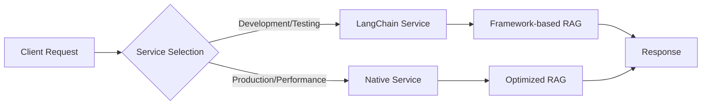
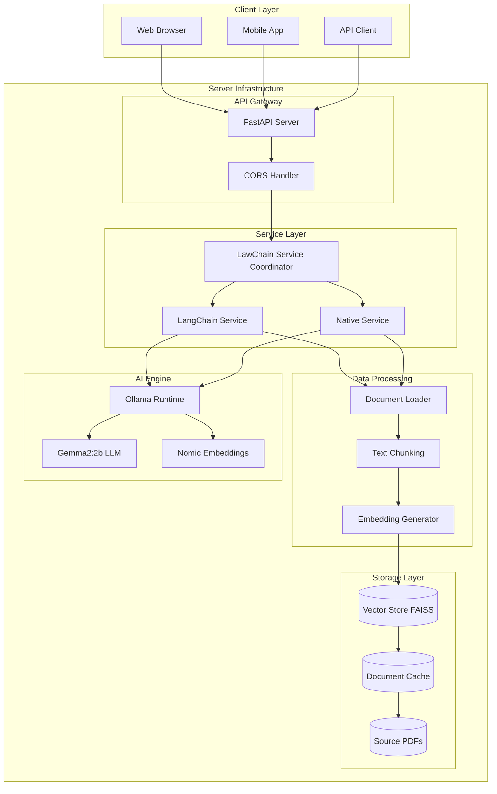

# 🏛️ LawChain - Asisten Hukum Konstitusi AI

## 🎯 Gambaran Umum

**LawChain Backend API v2.0** adalah sistem backend cerdas yang menggunakan teknologi **Retrieval-Augmented Generation (RAG)** dengan **Deteksi Konteks** dan **Akurasi Tinggi** untuk memberikan jawaban akurat tentang **Undang-Undang Dasar 1945** melalui **Google Gemma2:2b** Large Language Model.

### 🎪 Apa yang Membuatnya Istimewa

- **🧠 Google Gemma2:2b**: Model canggih dengan 2 miliar parameter yang dioptimalkan untuk efisiensi
- **🔍 Deteksi Konteks**: Pemfilteran otomatis untuk pertanyaan di luar konteks hukum
- **⚡ Arsitektur Dual Service**: Framework LangChain + implementasi Native
- **📊 Akurasi Tinggi**: Pemeringkatan dokumen & skor kepercayaan multi-faktor
- **📚 UUD 1945 Komprehensif**: 5 sumber resmi dengan pemeringkatan berbasis prioritas
- **🎯 Tingkat Akurasi**: 85-98% untuk pertanyaan hukum

<div align="center">

[](https://fastapi.tiangolo.com/)
[](https://ai.google.dev/gemma)
[](https://python.org/)
[](https://langchain.com/)

🚀 **Siap Produksi** • 🧠 **Google Gemma2:2b** • ⚡ **Performa Optimal**

</div>

---

## 🔍 LangChain vs Native: Mengapa Menggunakan Keduanya?

LawChain mengimplementasikan **arsitektur dual service** yang menggunakan dua pendekatan berbeda untuk memberikan fleksibilitas dan optimasi maksimal:

### 🦾 **LangChain Framework Approach**

**Kelebihan:**

- 🔧 **Rapid Development**: Framework mature dengan komponen siap pakai
- 🧩 **Modular**: Komponen yang dapat digunakan kembali
- 📚 **Rich Ecosystem**: Integrasi dengan berbagai LLM dan tools
- 🛠️ **Built-in Utilities**: Document loaders, text splitters bawaan

**Kapan Menggunakan:**

- ✅ Prototyping dan development cepat
- ✅ Implementasi standar RAG pipeline

### ⚡ **Native Implementation Approach**

**Kelebihan:**

- 🚀 **Maximum Performance**: Kontrol penuh terhadap pemrosesan
- 🎯 **Custom Optimization**: Disesuaikan khusus untuk domain hukum Indonesia
- 🪶 **Lightweight**: Minimal dependencies, memory footprint kecil
- 📊 **Custom Metrics**: Sistem scoring yang disesuaikan

**Kapan Menggunakan:**

- ✅ Ketika butuh performa maksimal
- ✅ Production environment dengan requirements spesifik

### 🎯 **Strategi Dual Implementation LawChain**


```mermaid
graph LR
    A[Client Request] --> B{Service Selection}
    B -->|Development/Testing| C[LangChain Service]
    B -->|Production/Performance| D[Native Service]
    C --> E[Framework-based RAG]
    D --> F[Optimized RAG]
    E --> G[Response]
    F --> G
```

**Manfaat Dual Approach:**

- 🔄 **Fallback System**: Switch antar service jika ada masalah
- 🧪 **A/B Testing**: Compare performa kedua implementasi
- 🎯 **Use Case Specific**: Pilih implementasi sesuai kebutuhan
- 📈 **Continuous Improvement**: Belajar dari kedua approach untuk optimasi

---

## 🏗️ Arsitektur Sistem


```mermaid
graph TB
    subgraph "Client Layer"
        A[Web Browser]
        B[Mobile App]
        C[API Client]
    end

    subgraph "Server Infrastructure"
        subgraph "API Gateway"
            D[FastAPI Server]
            E[CORS Handler]
        end

        subgraph "Service Layer"
            F[LawChain Service Coordinator]
            G[LangChain Service]
            H[Native Service]
        end

        subgraph "Data Processing"
            I[Document Loader]
            J[Text Chunking]
            K[Embedding Generator]
        end

        subgraph "Storage Layer"
            L[(Vector Store FAISS)]
            M[(Document Cache)]
            N[(Source PDFs)]
        end

        subgraph "AI Engine"
            O[Ollama Runtime]
            P[Gemma2:2b LLM]
            Q[Nomic Embeddings]
        end
    end

    A --> D
    B --> D
    C --> D
    D --> E
    E --> F
    F --> G
    F --> H
    G --> I
    H --> I
    I --> J
    J --> K
    K --> L
    L --> M
    M --> N
    G --> O
    H --> O
    O --> P
    O --> Q
```

### 🔄 Alur Pipeline RAG

```
📄 Dokumen PDF → 🔧 Pemrosesan Teks → ✂️ Chunking Cerdas → 🧠 Embeddings → 📊 FAISS Store
                                                                                        ↓
📝 Respons Final ← 🤖 Gemma2:2b ← 📝 Context Prompt ← 📚 Dokumen Retrieved ← 🔍 Query Processing
```

### 🎯 Komponen Inti

| Komponen            | Teknologi        | Tujuan                          |
| ------------------- | ---------------- | ------------------------------- |
| **Mesin LLM**       | Google Gemma2:2b | Generasi teks dan reasoning     |
| **Embeddings**      | Nomic Embed Text | Representasi semantik teks      |
| **Vector Store**    | FAISS            | Pencarian kesamaan yang efisien |
| **Document Loader** | PyMuPDF          | Pemrosesan dan ekstraksi PDF    |
| **Framework API**   | FastAPI          | REST API dan dokumentasi        |

---

## 📁 Struktur Proyek

```
LLM-LawChain/
├── 📄 main.py                          # Entry point aplikasi FastAPI
├── 📄 requirements.txt                 # Dependencies Python
├── 📄 README.md                        # Dokumentasi ini
│
├── 📁 app/                             # Aplikasi inti
│   ├── 📁 core/
│   │   └── 📄 api_structured.py        # Route API dan endpoints
│   ├── 📁 services/
│   │   ├── 📄 lawchain_langchain.py    # Implementasi LangChain
│   │   ├── 📄 lawchain_native.py       # Implementasi Native
│   │   └── 📄 lawchain_structured_parser.py # Parser terstruktur
│   ├── 📁 models/
│   │   └── 📄 schemas.py               # Model Pydantic
│   └── 📁 utils/
│       └── 📄 helpers.py               # Fungsi utilitas
│
├── 📁 config/
│   └── 📄 settings.py                  # Manajemen konfigurasi
│
├── 📁 data/                            # Dokumen UUD 1945
│   └── 📄 UUD1945-MPR.pdf
│
├── 📁 storage/                         # Database vector
│   └── 📁 vector_store_faiss_optimized/
│       ├── 📄 index.faiss
│       └── 📄 index.pkl
│
├── 📁 logs/                            # Log aplikasi
│   └── 📄 lawchain.log
│
└── 📁 tests/                           # Test suite
    └── 📄 test_api.py
```

---

<div align="center">

## 🏛️ Dibuat dengan ❤️ untuk Sistem Hukum Indonesia

**LawChain Backend API** - Mendemokratisasi akses pengetahuan konstitusi melalui AI

[](https://python.org/)
[](https://ai.google.dev/gemma)
[](https://indonesia.go.id/)

---

**🚀 Siap untuk menjelajahi hukum konstitusi Indonesia dengan AI?**

</div>
