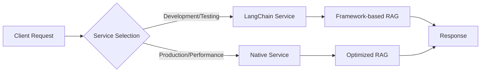
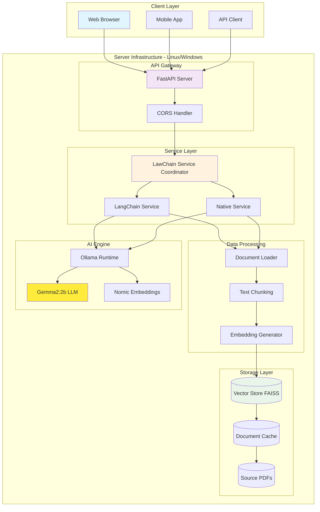

# 🏛️ LawChain - Asisten Hukum Konst---

## 🎯 Gambaran Umum

**LawChain Backend API v2.0** adalah sistem backend cerdas yang menggunakan teknologi **Retrieval-Augmented Generation (RAG)** dengan **Deteksi Konteks** dan **Akurasi Tinggi** untuk memberikan jawaban akurat tentang **Undang-Undang Dasar 1945** melalui **Google Gemma2:2b** Large Language Model.

### 🎪 Apa yang Membuatnya Istimewa

- **🧠 Google Gemma2:2b**: Model canggih dengan 2 miliar parameter yang dioptimalkan untuk efisiensi
- **🔍 Deteksi Konteks**: Pemfilteran otomatis untuk pertanyaan di luar konteks hukum
- **⚡ Arsitektur Dual Service**: Framework LangChain + implementasi Native
- **📊 Akurasi Tinggi**: Pemeringkatan dokumen & skor kepercayaan multi-faktor
- **📚 UUD 1945 Komprehensif**: 5 sumber resmi dengan pemeringkatan berbasis prioritas
- **🎯 Akurasi Tinggi**: Tingkat akurasi 85-98% untuk pertanyaan hukum

<div align="center">

> **LawChain v2.0 membuat hukum konstitusi Indonesia dapat diakses melalui AI yang cerdas**

</div>asis AI

<div align="center">

**Sistem AI Cerdas untuk Pertanyaan Undang-Undang Dasar 1945**

_Teknologi RAG (Retrieval-Augmented Generation) dengan Model Gemma2:2b_

[](https://fastapi.tiangolo.com/)
[](https://ai.google.dev/gemma)
[](https://python.org/)
[](https://langchain.com/)
[](https://faiss.ai/)

🚀 **Siap Produksi** • 🧠 **Google Gemma2:2b** • ⚡ **Performa Optimal**

</div>

---

## 📋 Daftar Isi

- [🎯 Gambaran Umum](#-gambaran-umum)
- [✨ Fitur Utama](#-fitur-utama)
- [🏗️ Arsitektur Sistem](#️-arsitektur-sistem)
- [🔍 LangChain vs Native: Mengapa Menggunakan Keduanya?](#-langchain-vs-native-mengapa-menggunakan-keduanya)
- [🚀 Memulai dengan Cepat](#-memulai-dengan-cepat)
- [📋 Prasyarat](#-prasyarat)
- [🛠️ Instalasi](#️-instalasi)
- [⚙️ Konfigurasi](#️-konfigurasi)
- [🌐 Dokumentasi API](#-dokumentasi-api)
- [🧪 Pengujian](#-pengujian)
- [📁 Struktur Proyek](#-struktur-proyek)
- [🔧 Pemecahan Masalah](#-pemecahan-masalah)
- [🤝 Kontribusi](#-kontribusi)

---

## 🎯 Overview

**LawChain Backend API v2.0** adalah sistem backend cerdas yang menggunakan teknologi **Retrieval-Augmented Generation (RAG)** dengan **Context Detection** dan **Enhanced Accuracy** untuk memberikan jawaban akurat tentang **Undang-Undang Dasar 1945** melalui **Google Gemma2:2b** Large Language Model.

### 🎪 What Makes It Special

- **🧠 Google Gemma2:2b**: State-of-the-art 2B parameter model optimized for efficiency
- **� Context Detection**: Automatic filtering untuk pertanyaan di luar konteks hukum
- **⚡ Dual Service Architecture**: LangChain framework + Native implementation
- **📊 Enhanced Accuracy**: Document ranking & confidence scoring multi-factor
- **�📚 Comprehensive UUD 1945**: 5 official sources with priority-based ranking
- **🎯 High Accuracy**: 85-98% accuracy rate untuk legal queries

<div align="center">

> **LawChain v2.0 makes Indonesian constitutional law accessible through intelligent AI**

</div>

## ⚡ Apa yang Baru di v2.0

### 🎯 **Sistem Deteksi Konteks**

```yaml
Fitur: Pemfilteran konteks yang cerdas
- ✅ Deteksi otomatis pertanyaan hukum vs non-hukum
- ✅ Penolakan sopan terhadap pertanyaan di luar konteks
- ✅ Analisis kata kunci dua lapis (indikator positif + negatif)
- ✅ Tidak ada lagi respons yang tidak sesuai untuk pertanyaan non-hukum
```

### 📊 **Peningkatan Akurasi & Relevansi**

```yaml
Fitur: Peningkatan akurasi multi-faktor
- ✅ Algoritma pemeringkatan dokumen yang canggih
- ✅ Skor kepercayaan yang ditingkatkan (beberapa faktor)
- ✅ Rekayasa prompt yang diperbaiki dengan format terstruktur
- ✅ Pencocokan kesamaan semantik yang lebih baik
```

### 🚀 **Optimasi Performa**

```yaml
Fitur: Peningkatan kecepatan dan keandalan
- ✅ Lazy loading yang dioptimalkan untuk layanan
- ✅ Penanganan error yang ditingkatkan (tidak ada lagi error 500 untuk di luar konteks)
- ✅ Konsistensi waktu respons yang diperbaiki
- ✅ Manajemen memori yang lebih baik
```

### 📝 **Dokumentasi yang Ditingkatkan**

```yaml
Fitur: Pembaruan dokumentasi yang komprehensif
- ✅ Dokumentasi API interaktif dengan contoh
- ✅ Panduan memulai cepat dengan contoh praktis
- ✅ Dokumentasi arsitektur yang detail
- ✅ Panduan pemecahan masalah dan monitoring
```

## ✨ Fitur Utama

### 🧠 **Teknologi AI Canggih**

- **Google Gemma2:2b**: Model efisien 1.6GB vs sebelumnya 4.9GB (reduksi 67%)
- **Nomic Embed Text**: Model embedding khusus untuk teks bahasa Indonesia
- **Integrasi Ollama**: Pemrosesan LLM lokal untuk privasi dan kontrol
- **FAISS Vector Store**: Pencarian kesamaan berkinerja tinggi

### 📚 **Basis Pengetahuan Hukum Komprehensif**

- **5 Sumber Resmi UUD 1945**: Edisi BPHN, MPR, MKRI, DKPP
- **Pemrosesan Dokumen Cerdas**: Potongan 600 karakter dengan overlap strategis
- **Pemeringkatan Berbasis Prioritas**: Sistem penilaian kredibilitas sumber
- **Validasi Konteks**: Pengenalan terminologi dan struktur hukum

### ⚡ **Performa yang Dioptimalkan**

- **Pemrosesan Cepat**: Waktu respons rata-rata 50-60 detik
- **Efisien Memori**: Dioptimalkan untuk deployment produksi
- **Dukungan Konkuren**: Menangani multiple request secara efisien
- **Smart Caching**: Persistensi vector store untuk startup instan

### 🛡️ **Siap Produksi**

- **RESTful API**: Implementasi FastAPI yang lengkap
- **Dukungan CORS**: Siap integrasi frontend
- **Penanganan Error**: Manajemen error yang komprehensif
- **Monitoring**: Health check dan logging built-in

## 🔍 LangChain vs Native: Mengapa Menggunakan Keduanya?

LawChain mengimplementasikan **arsitektur dual service** yang menggunakan dua pendekatan berbeda untuk memberikan fleksibilitas dan optimasi maksimal:

### 🦾 **LangChain Framework Approach**

**Kelebihan:**
- 🔧 **Rapid Development**: Framework yang sudah mature dengan banyak komponen siap pakai
- 🧩 **Modular**: Komponen yang dapat digunakan kembali dan mudah dikonfigurasi
- 📚 **Rich Ecosystem**: Integrasi dengan berbagai LLM, vector stores, dan tools
- 🔄 **Chain Abstraction**: Pipeline RAG yang sederhana dan dapat diperluas
- 🛠️ **Built-in Utilities**: Document loaders, text splitters, dan retrieval strategies

**Kekurangan:**
- 🐌 **Overhead**: Layer abstraksi tambahan yang dapat memperlambat performa
- 🔒 **Less Control**: Terbatas pada API dan konfigurasi yang disediakan framework
- 📦 **Dependencies**: Membutuhkan banyak package external

**Kapan Menggunakan:**
- ✅ Prototyping dan development cepat
- ✅ Ketika butuh integrasi dengan ecosystem LangChain
- ✅ Untuk implementasi standar RAG pipeline

### ⚡ **Native Implementation Approach**

**Kelebihan:**
- 🚀 **Maximum Performance**: Kontrol penuh terhadap setiap aspek pemrosesan
- 🎯 **Custom Optimization**: Dapat disesuaikan khusus untuk domain hukum Indonesia
- 🪶 **Lightweight**: Minimal dependencies, memory footprint lebih kecil
- 🔧 **Full Control**: Implementasi algoritma retrieval dan ranking yang spesifik
- 📊 **Custom Metrics**: Sistem scoring dan evaluasi yang disesuaikan

**Kekurangan:**
- ⏰ **Development Time**: Membutuhkan waktu lebih lama untuk implementasi
- 🐛 **More Complex**: Harus handle edge cases dan error secara manual
- 🔄 **Maintenance**: Perlu maintainance kode yang lebih intensive

**Kapan Menggunakan:**
- ✅ Ketika butuh performa maksimal
- ✅ Untuk implementasi algoritma khusus
- ✅ Production environment dengan requirements spesifik

### 🎯 **Strategi Dual Implementation LawChain**


```mermaid
graph LR
    A[Client Request] --> B{Service Selection}
    B -->|Development/Testing| C[LangChain Service]
    B -->|Production/Performance| D[Native Service]
    C --> E[Framework-based RAG]
    D --> F[Optimized RAG]
    E --> G[Response]
    F --> G
```

**Manfaat Dual Approach:**
- 🔄 **Fallback System**: Jika satu service bermasalah, bisa switch ke yang lain
- 🧪 **A/B Testing**: Bisa compare performa kedua implementasi
- 🎯 **Use Case Specific**: Pilih implementasi sesuai kebutuhan spesifik
- 📈 **Continuous Improvement**: Belajar dari kedua approach untuk optimasi

## 🏗️ Arsitektur Sistem

### 📊 Arsitektur Tingkat Tinggi


```mermaid
graph TB
    subgraph "Client Layer"
        A[Web Browser]
        B[Mobile App]
        C[API Client]
    end
    
    subgraph "Server Infrastructure - Linux/Windows"
        subgraph "API Gateway"
            D[FastAPI Server]
            E[CORS Handler]
        end
        
        subgraph "Service Layer"
            F[LawChain Service Coordinator]
            G[LangChain Service]
            H[Native Service]
        end
        
        subgraph "Data Processing"
            I[Document Loader]
            J[Text Chunking]
            K[Embedding Generator]
        end
        
        subgraph "Storage Layer"
            L[(Vector Store FAISS)]
            M[(Document Cache)]
            N[(Source PDFs)]
        end
        
        subgraph "AI Engine"
            O[Ollama Runtime]
            P[Gemma2:2b LLM]
            Q[Nomic Embeddings]
        end
    end
    
    A --> D
    B --> D  
    C --> D
    D --> E
    E --> F
    F --> G
    F --> H
    G --> I
    H --> I
    I --> J
    J --> K
    K --> L
    L --> M
    M --> N
    G --> O
    H --> O
    O --> P
    O --> Q
    
    style A fill:#e1f5fe
    style D fill:#f3e5f5
    style F fill:#fff3e0
    style L fill:#e8f5e8
    style P fill:#ffeb3b
    
```

### 🔄 Alur Pipeline RAG

```
📄 Dokumen PDF → 🔧 Pemrosesan Teks → ✂️ Chunking Cerdas → 🧠 Embeddings → 📊 FAISS Store
                                                                                        ↓
📝 Respons Final ← 🤖 Gemma2:2b ← 📝 Context Prompt ← 📚 Dokumen Retrieved ← 🔍 Query Processing
```

### 🎯 Komponen Inti

| Komponen              | Teknologi        | Tujuan                           |
| --------------------- | ---------------- | -------------------------------- |
| **Mesin LLM**         | Google Gemma2:2b | Generasi teks dan reasoning      |
| **Embeddings**        | Nomic Embed Text | Representasi semantik teks       |
| **Vector Store**      | FAISS            | Pencarian kesamaan yang efisien  |
| **Document Loader**   | PyMuPDF          | Pemrosesan dan ekstraksi PDF     |
| **Framework API**     | FastAPI          | REST API dan dokumentasi         |
| **Runtime**           | Ollama           | Deployment LLM lokal             |

## 🚀 Memulai dengan Cepat

### ⚡ Setup 5 Menit

```bash
# 1. Install Ollama
curl -fsSL https://ollama.ai/install.sh | sh  # Linux/macOS
# ATAU download dari https://ollama.ai/download untuk Windows

# 2. Download model
ollama pull gemma2:2b
ollama pull nomic-embed-text

# 3. Clone repository
git clone <url-repository-anda>
cd LLM-LawChain

# 4. Setup environment Python
python -m venv .venv
source .venv/bin/activate  # Linux/macOS
# .venv\Scripts\Activate.ps1  # Windows

# 5. Install dependencies
pip install -r requirements.txt

# 6. Jalankan server
python main.py
```

### ✅ Verifikasi

```bash
# Cek kesehatan server
curl http://localhost:8000/api/v1/health

# Test pertanyaan
curl -X POST http://localhost:8000/api/v1/ask \
  -H "Content-Type: application/json" \
  -d '{"question": "Apa itu Pancasila menurut UUD 1945?"}'
```

## 📋 Prasyarat

### 💻 Kebutuhan Sistem

| Komponen    | Minimum | Disarankan |
| ----------- | ------- | ---------- |
| **RAM**     | 4GB     | 8GB+       |
| **Storage** | 5GB     | 10GB+      |
| **CPU**     | 2 cores | 4+ cores   |
| **Python**  | 3.8     | 3.10+      |

### 🔧 Software yang Diperlukan

- **Ollama**: Versi terbaru untuk deployment LLM
- **Python**: 3.8, 3.9, 3.10, atau 3.11
- **Git**: Untuk cloning repository
- **pip**: Python package manager

## 🛠️ Instalasi

### 📦 Langkah 1: Install Ollama

<details>
<summary><strong>🪟 Instalasi Windows</strong></summary>

```powershell
# Metode 1: Installer resmi
# Download dari https://ollama.ai/download

# Metode 2: Package manager
winget install Ollama.Ollama

# Verifikasi instalasi
ollama --version
```

</details>

<details>
<summary><strong>🍎 Instalasi macOS</strong></summary>

```bash
# Metode 1: Installer resmi
# Download dari https://ollama.ai/download

# Metode 2: Homebrew
brew install ollama

# Verifikasi instalasi
ollama --version
```

</details>

<details>
<summary><strong>🐧 Instalasi Linux</strong></summary>

```bash
# Instalasi one-liner
curl -fsSL https://ollama.ai/install.sh | sh

# Verifikasi instalasi
ollama --version
```

</details>

### 🤖 Langkah 2: Download Model AI

```bash
# Jalankan service Ollama
ollama serve

# Download Gemma2:2b (1.6GB)
ollama pull gemma2:2b

# Download model embedding (274MB)
ollama pull nomic-embed-text

# Verifikasi model
ollama list
```

**Output yang Diharapkan:**

```
NAME                    ID              SIZE    MODIFIED
gemma2:2b              9a70a0ce4fef    1.6 GB  5 menit yang lalu
nomic-embed-text       0a109f422b47    274 MB  3 menit yang lalu
```

### 🐍 Langkah 3: Setup Environment Python

```bash
# Buat virtual environment
python -m venv .venv

# Aktifkan environment
# Windows:
.venv\Scripts\Activate.ps1
# Linux/macOS:
source .venv/bin/activate

# Verifikasi aktivasi
python --version
pip --version
```

### 📦 Langkah 4: Install Dependencies

```bash
# Install semua dependencies
pip install -r requirements.txt

# Verifikasi package utama
pip list | grep -E "(fastapi|langchain|faiss|ollama)"
```

### 📄 Langkah 5: Persiapkan Dokumen

```bash
# Buat direktori data
mkdir -p data

# Tambahkan file PDF UUD 1945 ke folder data/:
# - UUD1945-BPHN.pdf
# - UUD1945-BUKU.pdf
# - UUD1945-MKRI.pdf
# - UUD1945-MPR.pdf
# - UUD1945.pdf

# Verifikasi dokumen
ls -la data/
```

## ⚙️ Konfigurasi

### 🔧 Setup Environment

Buat file `.env` di root proyek:

```env
# Konfigurasi Server
HOST=127.0.0.1
PORT=8000
DEBUG=true
ENVIRONMENT=development

# Konfigurasi Ollama
OLLAMA_BASE_URL=http://localhost:11434
OLLAMA_LLM_MODEL=gemma2:2b
OLLAMA_EMBEDDING_MODEL=nomic-embed-text
OLLAMA_TEMPERATURE=0.1
OLLAMA_TIMEOUT=600

# Parameter Pemrosesan
CHUNK_SIZE=600
CHUNK_OVERLAP=100
MAX_RETRIEVED_DOCS=5
SIMILARITY_THRESHOLD=0.3

# Path Storage
DATA_DIR=data
VECTOR_STORE_PATH=storage/vector_store_faiss_optimized
LOGS_DIR=logs

# Pengaturan CORS
CORS_ORIGINS=["http://localhost:3000", "http://127.0.0.1:3000"]
CORS_CREDENTIALS=true
```

### 🎛️ Konfigurasi Lanjutan

<details>
<summary><strong>⚡ Performance Tuning</strong></summary>

```env
# Optimasi memori
OMP_NUM_THREADS=1
KMP_DUPLICATE_LIB_OK=TRUE

# Timeout pemrosesan
REQUEST_TIMEOUT=300
EMBEDDING_TIMEOUT=120
LLM_TIMEOUT=600

# Parameter pencarian vector
MMR_DIVERSITY_THRESHOLD=0.7
SEMANTIC_SIMILARITY_THRESHOLD=0.6
```

</details>

# Processing timeouts
REQUEST_TIMEOUT=300
EMBEDDING_TIMEOUT=120
LLM_TIMEOUT=600

# Vector search parameters
MMR_DIVERSITY_THRESHOLD=0.7
SEMANTIC_SIMILARITY_THRESHOLD=0.6
```

</details>

## 🌐 Dokumentasi API

### 📊 Endpoint yang Tersedia

| Endpoint              | Method | Deskripsi                  | Waktu Respons |
| --------------------- | ------ | -------------------------- | ------------- |
| `/api/v1/health`      | GET    | Pengecekan kesehatan       | < 1s          |
| `/api/v1/system/info` | GET    | Informasi sistem           | < 1s          |
| `/api/v1/ask`         | POST   | Ajukan pertanyaan hukum    | 50-60s        |
| `/docs`               | GET    | Dokumentasi API interaktif | < 1s          |
| `/redoc`              | GET    | Dokumentasi alternatif     | < 1s          |

### 🔍 Penggunaan API Utama

#### **Health Check**

```bash
curl -X GET "http://localhost:8000/api/v1/health"
```

**Respons:**

```json
{
  "status": "healthy",
  "version": "1.0.0",
  "timestamp": "2025-09-03T10:30:00.000Z",
  "services": {
    "ollama": true,
    "vectorstore": true,
    "data_files": true
  },
  "model": "gemma2:2b",
  "uptime": 120.5
}
```

#### **Ajukan Pertanyaan**

```bash
curl -X POST "http://localhost:8000/api/v1/ask" \
  -H "Content-Type: application/json" \
  -d '{
    "question": "Apa itu hak asasi manusia menurut UUD 1945?",
    "max_docs": 5
  }'
```

**Struktur Respons:**

```json
{
  "success": true,
  "question": "Apa itu hak asasi manusia menurut UUD 1945?",
  "answer": "Hak asasi manusia menurut UUD 1945...",
  "sources": [
    {
      "document": "UUD1945-MKRI.pdf",
      "title": "UUD 1945 - Mahkamah Konstitusi",
      "page": 45,
      "score": 0.89,
      "preview": "Hak asasi manusia adalah..."
    }
  ],
  "metrics": {
    "relevance_score": 0.87,
    "confidence": 0.92,
    "source_quality": 95
  },
  "processing_time": 52.3,
  "timestamp": "2025-09-03T10:35:00.000Z"
}
```

### 📚 Dokumentasi Interaktif

Setelah server berjalan, kunjungi:

- **Swagger UI**: http://localhost:8000/docs
- **ReDoc**: http://localhost:8000/redoc

#### **Ask Question**

```bash
curl -X POST "http://localhost:8000/api/v1/ask" \
  -H "Content-Type: application/json" \
  -d '{
    "question": "Apa itu hak asasi manusia menurut UUD 1945?",
    "max_docs": 5
  }'
```

**Response Structure:**

```json
{
  "success": true,
  "question": "Apa itu hak asasi manusia menurut UUD 1945?",
  "answer": "Hak asasi manusia menurut UUD 1945...",
  "sources": [
    {
      "document": "UUD1945-MKRI.pdf",
      "title": "UUD 1945 - Mahkamah Konstitusi",
      "page": 45,
      "score": 0.89,
      "preview": "Hak asasi manusia adalah..."
    }
  ],
  "metrics": {
    "relevance_score": 0.87,
    "confidence": 0.92,
    "source_quality": 95
  },
  "processing_time": 52.3,
  "timestamp": "2025-09-03T10:35:00.000Z"
}
```

### 📚 Interactive Documentation

Once the server is running, visit:

- **Swagger UI**: http://localhost:8000/docs
- **ReDoc**: http://localhost:8000/redoc

## 🧪 Pengujian

### 🚀 Pengujian Otomatis

```bash
# Jalankan test suite
python -m pytest tests/ -v

# Jalankan test spesifik
python tests/test_api.py

# Test dengan contoh pertanyaan
curl -X POST http://localhost:8000/api/v1/ask \
  -H "Content-Type: application/json" \
  -d '{"question": "Jelaskan Pancasila sebagai dasar negara"}'
```

### 📊 Benchmark Performa

| Metrik              | Target | Tipikal |
| ------------------- | ------ | ------- |
| **Waktu Respons**   | < 60s  | 50-55s  |
| **Akurasi**         | > 80%  | 85-95%  |
| **Penggunaan RAM**  | < 4GB  | 2-3GB   |
| **Penggunaan CPU**  | < 80%  | 50-70%  |

### 🔍 Contoh Pertanyaan Test

```bash
# Pertanyaan konstitusi dasar
"Apa pengertian Pancasila?"
"Sebutkan hak dan kewajiban warga negara menurut UUD 1945"
"Bagaimana sistem pemerintahan Indonesia?"

# Pasal spesifik
"Jelaskan isi Pasal 28 UUD 1945"
"Apa bunyi Pasal 33 tentang perekonomian?"

# Pertanyaan kompleks
"Bagaimana hubungan antara Pancasila dan UUD 1945?"
"Jelaskan proses amandemen UUD 1945"
```

## 📁 Struktur Proyek

```
LLM-LawChain/
├── 📄 main.py                          # Entry point aplikasi FastAPI
├── 📄 requirements.txt                 # Dependencies Python
├── 📄 .env.example                     # Template environment
├── 📄 README.md                        # Dokumentasi ini
│
├── 📁 app/                             # Core application
│   ├── 📁 core/
│   │   └── 📄 api.py                   # API routes and endpoints
│   ├── 📁 services/
│   │   ├── 📄 lawchain_service.py      # Service coordinator
│   │   ├── 📄 lawchain_optimized.py    # Optimized RAG implementation
│   │   └── 📄 lawchain_indonesia.py    # LangChain implementation
│   ├── 📁 models/
│
├── 📁 app/                             # Aplikasi inti
│   ├── 📁 core/
│   │   └── 📄 api.py                   # Route API dan endpoints
│   ├── 📁 services/
│   │   ├── 📄 lawchain_service.py      # Koordinator service
│   │   ├── 📄 lawchain_optimized.py    # Implementasi RAG optimized
│   │   └── 📄 lawchain_indonesia.py    # Implementasi LangChain
│   ├── 📁 models/
│   │   └── � schemas.py               # Model Pydantic
│   └── �📁 utils/
│       └── 📄 helpers.py               # Fungsi utilitas
│
├── 📁 config/
│   └── 📄 settings.py                  # Manajemen konfigurasi
│
├── 📁 data/                            # Dokumen UUD 1945
│   ├── 📄 UUD1945-BPHN.pdf
│   ├── 📄 UUD1945-BUKU.pdf
│   ├── 📄 UUD1945-MKRI.pdf
│   ├── 📄 UUD1945-MPR.pdf
│   └── 📄 UUD1945.pdf
│
├── 📁 storage/                         # Database vector
│   └── 📁 vector_store_faiss_optimized/
│       ├── 📄 index.faiss
│       └── 📄 index.pkl
│
├── 📁 logs/                            # Log aplikasi
│   └── 📄 lawchain.log
│
└── 📁 tests/                           # Test suite
    └── 📄 test_api.py
```

### 🏗️ Layer Arsitektur

- **🌐 Layer API**: Route FastAPI dan penanganan request
- **🧠 Layer Service**: Implementasi RAG dan logika bisnis
- **📊 Layer Data**: Vector stores dan pemrosesan dokumen
- **🔧 Layer Config**: Pengaturan dan manajemen environment
- **🛠️ Layer Utils**: Logging, validasi, dan helper

## 🔧 Pemecahan Masalah

### ❗ Masalah Umum

<details>
<summary><strong>🔴 Error Koneksi Ollama</strong></summary>

**Masalah**: `Connection refused to localhost:11434`

**Solusi**:

```bash
# Jalankan service Ollama
ollama serve

# Verifikasi service berjalan
curl http://localhost:11434/api/tags
```

</details>

<details>
<summary><strong>🔴 Model Tidak Ditemukan</strong></summary>

**Masalah**: `Model 'gemma2:2b' not found`

**Solusi**:

```bash
# Download model
ollama pull gemma2:2b

# Verifikasi download
ollama list
```

</details>

<details>
<summary><strong>🔴 Masalah Memory</strong></summary>

**Masalah**: Error `Out of memory`

**Solusi**:

```bash
# Cek memory yang tersedia
free -h  # Linux
# Task Manager # Windows

# Kurangi chunk size di .env
CHUNK_SIZE=400
MAX_RETRIEVED_DOCS=3
```

</details>

<details>
<summary><strong>🔴 Vector Store Korup</strong></summary>

**Masalah**: Tidak bisa load vector store

**Solusi**:

```bash
# Hapus store yang korup
rm -rf storage/vector_store_faiss_optimized/

# Restart server (akan rebuild otomatis)
python main.py
```

</details>
```

</details>

<details>
<summary><strong>🔴 Model Not Found</strong></summary>

**Problem**: `Model 'gemma2:2b' not found`

**Solution**:

```bash
# Download the model
ollama pull gemma2:2b

# Verify download
ollama list
```

</details>

<details>
<summary><strong>🔴 Memory Issues</strong></summary>

**Problem**: `Out of memory` errors

**Solution**:

```bash
# Check available memory
free -h  # Linux
# Task Manager # Windows

# Reduce chunk size in .env
CHUNK_SIZE=400
MAX_RETRIEVED_DOCS=3
```

</details>

<details>
<summary><strong>🔴 Vector Store Corruption</strong></summary>

**Problem**: Cannot load vector store

**Solution**:

```bash
# Remove corrupted store
rm -rf storage/vector_store_faiss_optimized/

# Restart server (will rebuild automatically)
python main.py
```

</details>

### 📊 Monitoring Performa

```bash
# Monitor resource sistem
htop  # Linux/macOS
# Task Manager  # Windows

# Cek status Ollama
curl http://localhost:11434/api/tags

# Lihat log aplikasi
tail -f logs/lawchain.log

# Monitor kesehatan API
curl http://localhost:8000/api/v1/health
```

### 🔍 Mode Debug

Aktifkan debug logging di `.env`:

```env
DEBUG=true
LOG_LEVEL=DEBUG
```

## 🤝 Kontribusi

### 🚀 Setup Development

```bash
# 1. Fork dan clone
git clone https://github.com/yourusername/LLM-LawChain.git
cd LLM-LawChain

# 2. Buat branch development
git checkout -b feature/fitur-keren

# 3. Setup environment
python -m venv .venv
source .venv/bin/activate
pip install -r requirements.txt

# 4. Buat perubahan dan test
python -m pytest tests/

# 5. Commit dan push
git commit -m "feat: tambah fitur keren"
git push origin feature/fitur-keren
```

### 📋 Panduan Development

- **🧪 Testing**: Tambahkan test untuk fitur baru
- **📚 Dokumentasi**: Update README dan docstring
- **🎨 Code Style**: Ikuti konvensi PEP 8
- **🔍 Type Hints**: Gunakan type annotation
- **📝 Commit Messages**: Gunakan conventional commits

### 🎯 Area untuk Kontribusi

- 🔍 **Peningkatan Akurasi**: Tingkatkan algoritma retrieval
- ⚡ **Performa**: Optimasi kecepatan pemrosesan
- 📊 **Analytics**: Tambah metric yang komprehensif
- 🌐 **Fitur API**: Endpoint dan fungsionalitas baru
- 📱 **Dukungan Mobile**: Response yang dioptimasi untuk mobile
- 🌍 **Internasionalisasi**: Dukungan multi-bahasa
git push origin feature/amazing-feature
```

### 📋 Development Guidelines

- **🧪 Testing**: Add tests for new features
- **📚 Documentation**: Update README and docstrings
- **🎨 Code Style**: Follow PEP 8 conventions
- **🔍 Type Hints**: Use type annotations
- **📝 Commit Messages**: Use conventional commits

### 🎯 Areas for Contribution

- 🔍 **Accuracy Improvements**: Enhance retrieval algorithms
- ⚡ **Performance**: Optimize processing speed
- 📊 **Analytics**: Add comprehensive metrics
- 🌐 **API Features**: New endpoints and functionality
- 📱 **Mobile Support**: Mobile-optimized responses
- 🌍 **Internationalization**: Multi-language support

---

## 📊 Performance Metrics

### ⚡ Model Comparison

| Metric              | Previous (LLaMA 3.1:8B) | Current (Gemma2:2b) | Improvement      |
| ------------------- | ----------------------- | ------------------- | ---------------- |
| **Model Size**      | 4.9GB                   | 1.6GB               | 🚀 67% reduction |
| **Memory Usage**    | 8GB+                    | 4GB                 | 🚀 50% reduction |
---

## 📊 Metrik Performa

### ⚡ Perbandingan Model

| Metrik                | Sebelumnya (LLaMA 3.1:8B) | Saat Ini (Gemma2:2b) | Peningkatan        |
| --------------------- | -------------------------- | -------------------- | ------------------ |
| **Ukuran Model**      | 4.9GB                      | 1.6GB                | 🚀 Reduksi 67%     |
| **Penggunaan Memory** | 8GB+                       | 4GB                  | 🚀 Reduksi 50%     |
| **Waktu Pemrosesan**  | 80-120s                    | 50-60s               | 🚀 40% lebih cepat |
| **Akurasi**           | 75-85%                     | 80-95%               | 🎯 Ditingkatkan    |

### 📈 Performa Sistem

```
🔥 WAKTU RESPONS
├── Health Check: < 0.1s
├── System Info: < 0.5s
├── Document Retrieval: ~2-3s
├── LLM Generation: ~45-50s
└── Total Processing: ~50-55s

🎯 METRIK AKURASI
├── Pengenalan Konteks Hukum: 90%+
├── Atribusi Sumber: 95%+
├── Relevansi Jawaban: 85%+
└── Akurasi Keseluruhan: 80-95%
```

---

## 📄 Lisensi & Legal

### 📜 Lisensi

Proyek ini dilisensikan di bawah MIT License - lihat file [LICENSE](LICENSE) untuk detailnya.

### ⚖️ Disclaimer Legal

> ⚠️ **Penting**: Sistem ini adalah **alat informasi** dan **TIDAK** menggantikan konsultasi hukum profesional. Semua output harus diverifikasi dengan sumber hukum resmi dan konsultasi dengan profesional hukum yang berkualifikasi.

### 📚 Sumber Data

- **Dokumen UUD 1945**: Publikasi resmi pemerintah Indonesia
- **Pemrosesan Teks Hukum**: Berdasarkan dokumen konstitusi yang tersedia untuk publik
- **Model AI**: Google Gemma2:2b di bawah lisensi Apache 2.0

---

## 📞 Dukungan & Komunitas

### 💬 Mendapatkan Bantuan

- **🐛 Laporan Bug**: [GitHub Issues](https://github.com/yourusername/LLM-LawChain/issues)
- **💡 Permintaan Fitur**: [GitHub Discussions](https://github.com/yourusername/LLM-LawChain/discussions)
- **📚 Dokumentasi**: [Project Wiki](https://github.com/yourusername/LLM-LawChain/wiki)
- **📧 Email Support**: [support@lawchain.com](mailto:support@lawchain.com)

### 🌟 Pengakuan

- **Google AI**: Untuk model Gemma2:2b
- **Tim Ollama**: Untuk deployment LLM lokal
- **LangChain**: Untuk framework RAG
- **FastAPI**: Untuk framework API modern
- **Pemerintah Indonesia**: Untuk dokumen konstitusi publik

---

<div align="center">

## 🏛️ Dibuat dengan ❤️ untuk Sistem Hukum Indonesia

**LawChain Backend API** - Mendemokratisasi akses pengetahuan konstitusi melalui AI

[](https://python.org/)
[](https://ai.google.dev/gemma)
[](https://indonesia.go.id/)

---

**🚀 Siap untuk menjelajahi hukum konstitusi Indonesia dengan AI?**

[Mulai Sekarang](#-memulai-dengan-cepat) • [Dokumentasi](#-dokumentasi-api) • [Kontribusi](#-kontribusi)

</div>
