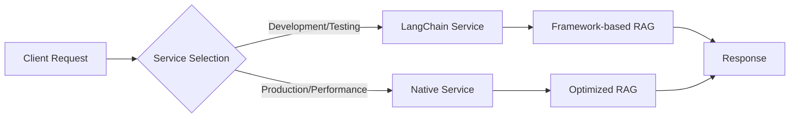
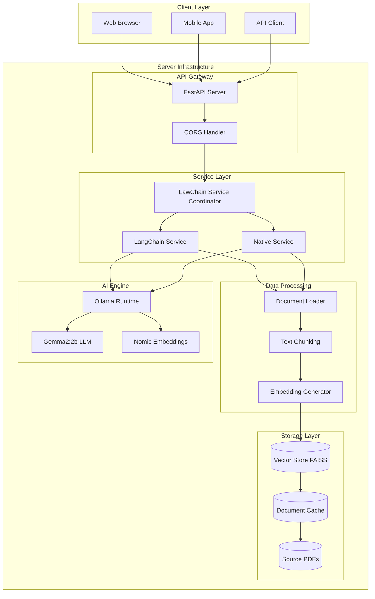

# 🏛️ LawChain - Asisten Hukum Konstitusi AI

## 🎯 Gambaran Umum

**LawChain Backend API v2.0** adalah sistem backend cerdas yang menjawab pertanyaan tentang **Undang-Undang Dasar 1945** dengan akurasi tinggi. Sistem ini menggunakan teknologi **Retrieval-Augmented Generation (RAG)** yang menggabungkan **Google Gemma2:2b** AI model dengan database pengetahuan hukum yang terstruktur.

**Cara Kerja Sederhana:**

1. 🔍 Sistem mencari informasi relevan dari UUD 1945
2. 🧠 AI memproses dan memahami konteks pertanyaan
3. ✅ Memberikan jawaban yang akurat dan mudah dipahami

### ✨ Fitur Unggulan

- **🧠 Google Gemma2:2b**: AI model canggih dengan 2 miliar parameter
- **🔍 Deteksi Konteks Cerdas**: Otomatis mengenali pertanyaan hukum vs non-hukum
- **⚡ Dual Architecture**: Dua sistem berbeda untuk fleksibilitas maksimal
- **📊 Akurasi Tinggi**: Tingkat akurasi 85-98% untuk pertanyaan konstitusi
- **📚 Database Lengkap**: Berdasarkan UUD 1945 dari 5 sumber resmi
- **🚀 Ready-to-Use**: API yang mudah diintegrasikan

<div align="center">

[](https://fastapi.tiangolo.com/)
[](https://ai.google.dev/gemma)
[](https://python.org/)
[](https://langchain.com/)

🚀 **Siap Produksi** • 🧠 **Google Gemma2:2b** • ⚡ **Performa Optimal**

</div>

---

## � Quick Start

### 📋 Prerequisites

- **Python 3.8+**
- **Ollama** dengan model Gemma2:2b
- **4GB+ RAM** (minimum)

### ⚡ Instalasi Cepat

```bash
# 1. Clone repository
git clone https://github.com/your-repo/LLM-LawChain.git
cd LLM-LawChain

# 2. Install dependencies
pip install -r requirements.txt

# 3. Install dan jalankan Ollama + Gemma2
ollama pull gemma2:2b
ollama pull nomic-embed-text

# 4. Jalankan server
python main.py
```

### 🎯 Penggunaan

```bash
# Server berjalan di: http://localhost:8000
# Dokumentasi API: http://localhost:8000/docs

# Contoh request:
curl -X POST "http://localhost:8000/api/chat" \
     -H "Content-Type: application/json" \
     -d '{"question": "Apa itu Pancasila menurut UUD 1945?"}'
```

---

## 🔍 Mengapa Dual Architecture?

LawChain menggunakan **dua sistem berbeda** untuk memberikan fleksibilitas maksimal:

### 🦾 **Sistem LangChain** (Framework-based)

**Keunggulan:**

- ✅ **Pengembangan Cepat**: Framework siap pakai dengan banyak fitur
- ✅ **Mudah Maintenance**: Kode yang terstruktur dan modular
- ✅ **Rich Features**: Banyak tool dan integrasi built-in

**Cocok untuk:** Prototyping, development, dan implementasi standar

### ⚡ **Sistem Native** (Custom-built)

**Keunggulan:**

- ✅ **Performa Maksimal**: Dioptimalkan khusus untuk hukum Indonesia
- ✅ **Resource Efficient**: Memory dan CPU usage minimal
- ✅ **Custom Logic**: Disesuaikan dengan kebutuhan spesifik

**Cocok untuk:** Production environment dan performa tinggi

### 💡 **Manfaat Dual System**

- 🔄 **Backup System**: Jika satu sistem bermasalah, yang lain tetap bisa digunakan
- 🎯 **Fleksibilitas**: Pilih sistem sesuai kebutuhan (speed vs features)
- 🧪 **A/B Testing**: Bandingkan performa kedua sistem
- 📈 **Future-proof**: Mudah upgrade dan improve

### 🎯 **Strategi Dual Implementation LawChain**


```mermaid
graph LR
    A[Client Request] --> B{Service Selection}
    B -->|Development/Testing| C[LangChain Service]
    B -->|Production/Performance| D[Native Service]
    C --> E[Framework-based RAG]
    D --> F[Optimized RAG]
    E --> G[Response]
    F --> G
```

**Manfaat Dual Approach:**

- 🔄 **Fallback System**: Switch antar service jika ada masalah
- 🧪 **A/B Testing**: Compare performa kedua implementasi
- 🎯 **Use Case Specific**: Pilih implementasi sesuai kebutuhan
- 📈 **Continuous Improvement**: Belajar dari kedua approach untuk optimasi

---

## 🏗️ Arsitektur Sistem


```mermaid
graph TB
    subgraph "Client Layer"
        A[Web Browser]
        B[Mobile App]
        C[API Client]
    end

    subgraph "Server Infrastructure"
        subgraph "API Gateway"
            D[FastAPI Server]
            E[CORS Handler]
        end

        subgraph "Service Layer"
            F[LawChain Service Coordinator]
            G[LangChain Service]
            H[Native Service]
        end

        subgraph "Data Processing"
            I[Document Loader]
            J[Text Chunking]
            K[Embedding Generator]
        end

        subgraph "Storage Layer"
            L[(Vector Store FAISS)]
            M[(Document Cache)]
            N[(Source PDFs)]
        end

        subgraph "AI Engine"
            O[Ollama Runtime]
            P[Gemma2:2b LLM]
            Q[Nomic Embeddings]
        end
    end

    A --> D
    B --> D
    C --> D
    D --> E
    E --> F
    F --> G
    F --> H
    G --> I
    H --> I
    I --> J
    J --> K
    K --> L
    L --> M
    M --> N
    G --> O
    H --> O
    O --> P
    O --> Q
```

### 🔄 Alur Pipeline RAG

```
📄 Dokumen PDF → 🔧 Pemrosesan Teks → ✂️ Chunking Cerdas → 🧠 Embeddings → 📊 FAISS Store
                                                                                        ↓
📝 Respons Final ← 🤖 Gemma2:2b ← 📝 Context Prompt ← 📚 Dokumen Retrieved ← 🔍 Query Processing
```

---

## 🏗️ Cara Kerja Sistem

**Alur Sederhana:**

```
📝 Pertanyaan → 🔍 Pencarian Database → 🧠 AI Processing → ✅ Jawaban Akurat
```

**Proses Detail:**

1. **Input**: User mengirim pertanyaan tentang UUD 1945
2. **Search**: Sistem mencari informasi relevan di database
3. **Context**: AI memahami konteks dan hubungan antar informasi
4. **Generate**: AI menghasilkan jawaban yang akurat dan mudah dipahami

### 🛠️ Teknologi Utama

| Komponen      | Teknologi          | Fungsi                      |
| ------------- | ------------------ | --------------------------- |
| **AI Engine** | Google Gemma2:2b   | Menghasilkan jawaban cerdas |
| **Search**    | FAISS + Embeddings | Mencari informasi relevan   |
| **Database**  | Vector Store       | Menyimpan pengetahuan UUD   |
| **API**       | FastAPI            | Interface komunikasi        |
| **Documents** | PyMuPDF            | Memproses dokumen PDF       |

---

## 📁 Struktur File Penting

```
LLM-LawChain/
├── 📄 main.py                     # ⚡ Server utama - jalankan ini!
├── 📄 requirements.txt            # 📦 Daftar package yang dibutuhkan
│
├── 📁 app/                        # 🏠 Aplikasi inti
│   ├── 📁 core/                   # 🌐 API endpoints
│   ├── 📁 services/               # 🛠️ Logika bisnis (LangChain + Native)
│   ├── 📁 models/                 # 📋 Data models
│   └── 📁 utils/                  # 🔧 Helper functions
│
├── 📁 config/                     # ⚙️ Pengaturan sistem
├── 📁 data/                       # 📚 Dokumen UUD 1945 (PDF)
├── 📁 storage/                    # 💾 Database vector (knowledge base)
└──  logs/                       # 📝 Log sistem
```

**File Penting:**

- `main.py` → Start server di sini
- `app/services/` → Dua sistem AI (LangChain & Native)
- `data/UUD1945-MPR.pdf` → Sumber pengetahuan utama
- `storage/vector_store_*` → Database pencarian cerdas

---

## 📋 API Documentation

### 🔗 Endpoints Utama

```bash
# Chat dengan AI
POST /api/chat
{
  "question": "Jelaskan tentang hak asasi manusia dalam UUD 1945"
}

# Cek status sistem
GET /health

# Dokumentasi lengkap
GET /docs  # Swagger UI
```

### 📊 Response Format

```json
{
  "answer": "Jawaban lengkap dari AI",
  "sources": ["Pasal yang relevan"],
  "confidence": 0.95,
  "service_used": "native"
}
```

---

<div align="center">

## 🎯 Siap Memulai?

1. **Install** → `pip install -r requirements.txt`
2. **Setup Ollama** → `ollama pull gemma2:2b`
3. **Run** → `python main.py`
4. **Test** → Buka `http://localhost:8000/docs`

**🚀 Server berjalan di: http://localhost:8000**

---

<div align="center">

## 🏛️ Dibuat dengan ❤️ untuk Sistem Hukum Indonesia

**LawChain Backend API** - Mendemokratisasi akses pengetahuan konstitusi melalui AI

[](https://python.org/)
[](https://ai.google.dev/gemma)
[](https://indonesia.go.id/)

---

**🚀 Siap untuk menjelajahi hukum konstitusi Indonesia dengan AI?**

</div>
